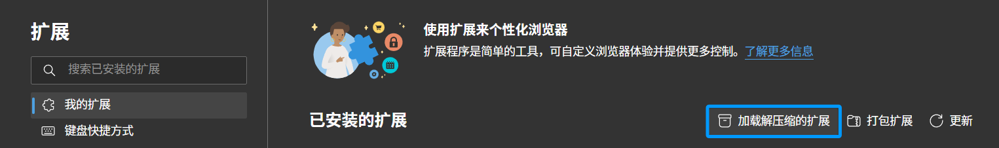
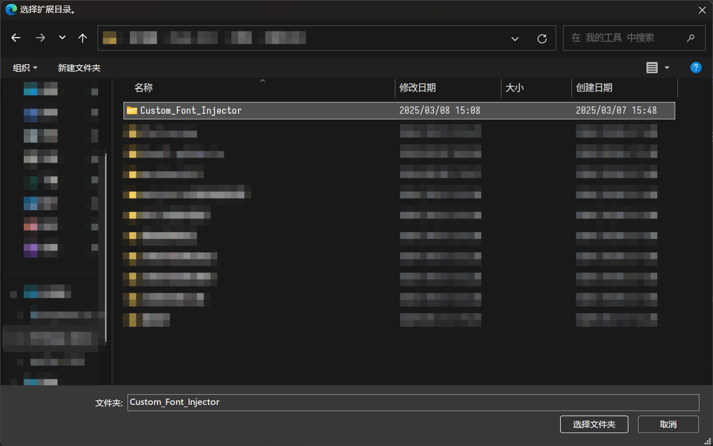
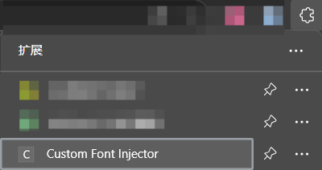
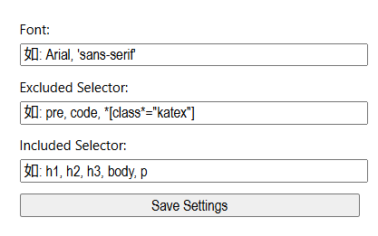

# 这是一个轻量化但有效且不无脑的字体覆盖插件

## 安装

遵循标准的chrome扩展安装流程即可

1. 打开浏览器扩展选项，确保已启用开发者模式，然后点击“加载已解压的扩展程序”

    

2. 选择本项目的文件夹，然后点击“选择文件夹”

    

3. 点击扩展图标，即可使用
    

## 使用

直接点击该扩展，会弹出一个简易设置框

第一栏可以填入系统上的自定义字体，格式为标准的 css font-family 格式。在这个设置页面字体是实时预览的

第二栏和第三栏分别为过滤选择器和强制渲染选择器，格式同样为标准的 css ，如果你没有特别的需求，直接使用默认值即可。其中，若网页某元素匹配上过滤选择器，则它和它的子元素都会被跳过；而匹配上强制渲染则保证一定添加字体覆盖

> 正常情况下，添加样式覆盖采用的是往包含 `class` 的元素追加自定义样式类的方式，而强制渲染则是往该元素的 `style` 中写入自定义样式内容
> 默认过滤设置 `'pre, code, *[class*="katex"] [aria-hidden="true"], [class*="fa-"], .fa, .fab, .fad, .fal, .far, .fas, .fass, .fasr, .fat, .icofont, [style*="font-"], [class*="icon"], [class*="Icon"], [class*="symbol"], [class*="Symbol"], .glyphicon, [class*="material-symbol"], [class*="material-icon"], mu, [class*="mu-"], .typcn, [class*="vjs-"]'`

需要注意的是，**第一次打开设置框时，需要填写设置后点击“Save Settings”按钮，才能将设置保存到本地**，若没有手动指定任何值（或者保存值为空），那么每次打开设置框时，都会显示上图的提示

如果你没有别的特别需求，可以直接将 `"如: "` 删除，留下格式正确的默认设置，然后点击保存即可

此外，也可以通过点击该扩展右侧的三个小点，再选择“扩展选项”来打开设置框。该设置框使用和弹出框是完全相同的，故不再赘述

**设置完成后，若页面没有更新，则需要手动刷新页面**